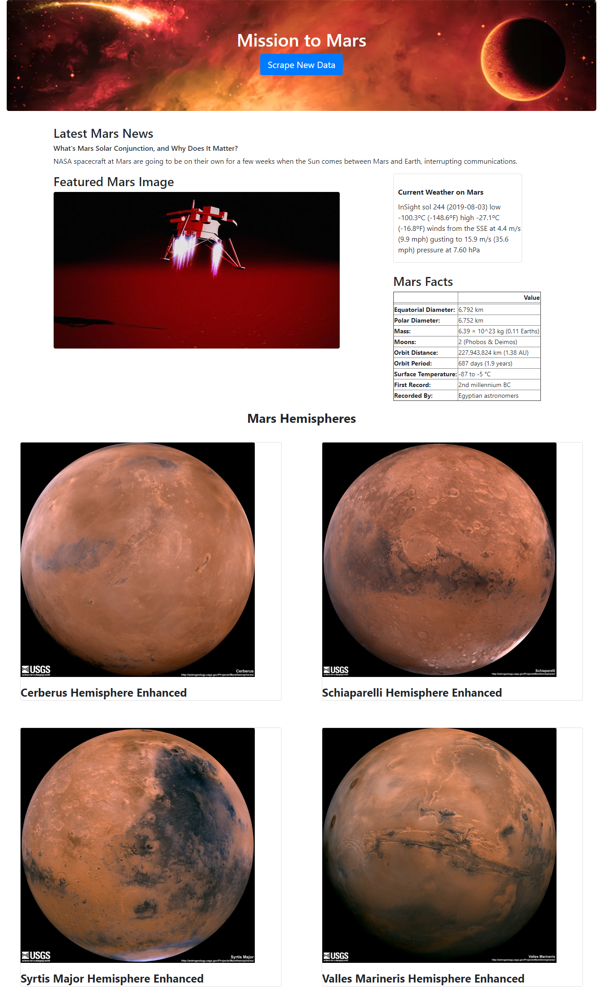

# Mission to Mars
It's a flask web application that scrapes various websites for data related to the Mission to Mars and displays the information in a single HTML page.

### Scraping
#### Nasa Mars News
Collect the latest News Title and Paragraph Text.

#### JPL Mars Space Images - Featured Image
Useing the splinter find the image url for the current Featured Mars Image.

#### Mars Weather
From the Mars Weather twitter account scrape the latest Mars weather tweet from the page. 

#### Mars Facts
From the Mars Facts webpage and Pandas to scrape the table containing facts about the planet including Diameter, Mass, etc.

#### Mars Hemispheres
From the USGS Astrogeology site obtain high resolution images for each of Mar's hemispheres.

### MongoDB and Flask Application
MongoDB with Flask templating to create a HTML page that displays all of the information that was scraped from the URLs above.

